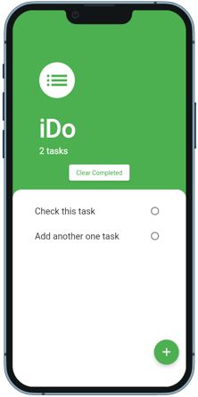
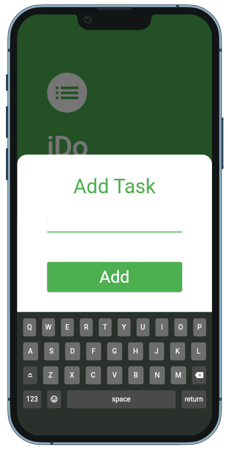

# iDo

A ToDo application

## What can this app do?

The Todo application allows you to add tasks to a list, 
mark the completion and clear completed tasks. The task list 
is saved locally when changes are made.

Todo приложение позволяет добавлять задачи в лист, отмечать 
выполнение и очищать выполненные задачи. Лист задач сохраняется 
локально при изменениях.

 